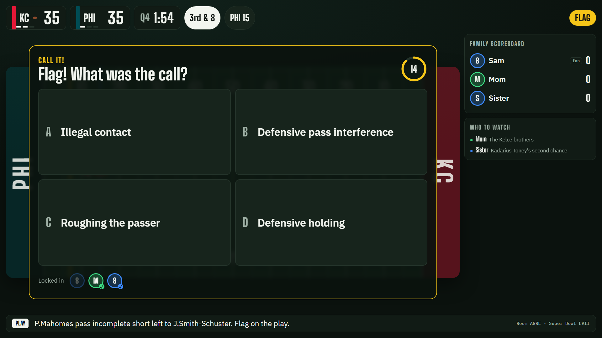
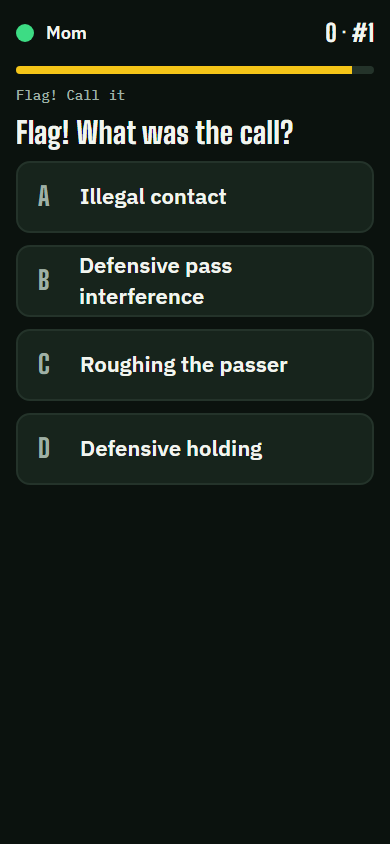
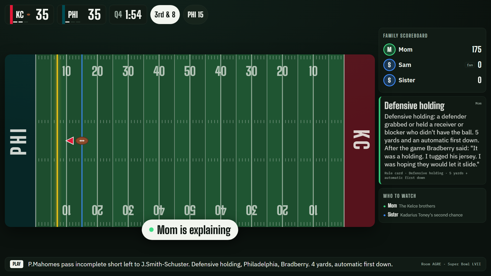
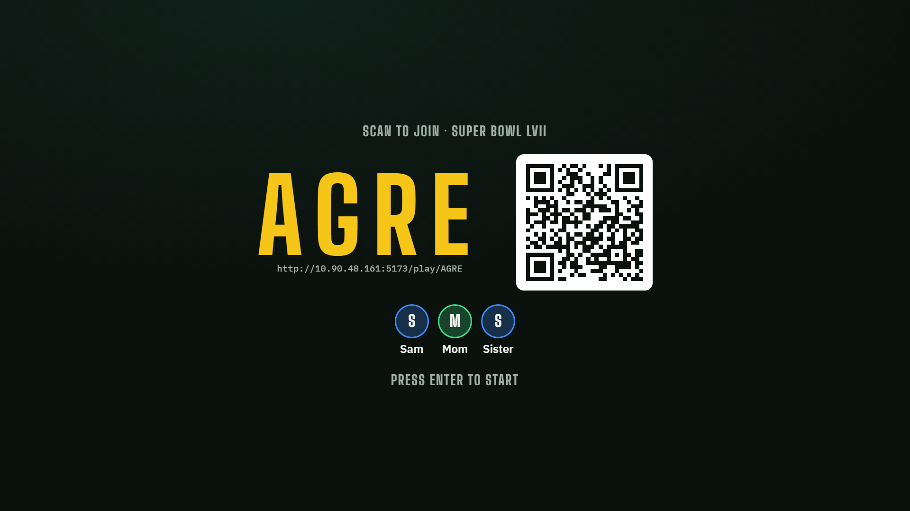

# Huddle

A game-night co-host that turns the non-fans in your family into fellow fans, then gets out of the way.

A laptop drives the TV (the shared screen). Everyone joins on their phone, which works only as a buzzer. Huddle replays a real NFL game (Super Bowl LVII) from open nflverse play-by-play data and:

- **Stakes first.** Before 4th downs, two-point tries and field goals, everyone predicts on their phone. A family scoreboard keeps points.
- **Call It.** When a flag is thrown, everyone guesses the penalty before the referee announces it.
- **Explains in dead time.** Between plays an AI Director decides whether anything is worth explaining to *these* people, and says one short line with a caption card.
- **People teach people.** The fan's phone offers "Take it?" with a cheat line before Huddle explains; learners who know a rule get asked to explain it to the others.
- **Fades out.** Huddle tracks what each person knows and explains less as they learn.

Product requirements: [`docs/PRD.md`](docs/PRD.md). Implementation spec: [`BUILD_PROMPT.md`](BUILD_PROMPT.md). Choices and deviations: [`DECISIONS.md`](DECISIONS.md).

| Shared screen: Call It on the Bradberry flag | Phone: Call It |
|---|---|
|  |  |
| **After the call: a learner explains (handoff)** | **Lobby** |
|  |  |

More in [`docs/`](docs/): setup, storylines, live field, host dock, phone join/profile/waiting.

## PRD traceability

Status: **done** = implemented and verified by the named test or script. "Manual" = a check the team should do by hand.

| PRD ID | Feature | Priority | Status | Main files | Verified by |
|---|---|---|---|---|---|
| F1 | Rooms and joining | P0 | done | `server/room/RoomManager.ts`, `server/sockets.ts`, `server/http.ts`, `web/src/pages/Play.tsx`, `web/src/components/tv/Stages.tsx` | `room.test.ts` "F1 rooms and joining" (refresh keeps points and role); `npm run smoke` (4-letter code, 3 phones join, refresh rejoins as same player). Manual: five phones join in under 60 s. |
| F2 | Pre-game profiles and storylines | P0 | done | `server/game/storylines.ts`, `server/room/Room.ts` (`finishProfiles`, `assignOne`), `web/src/components/phone/JoinProfile.tsx`, `data/games/2022_22_KC_PHI/storylines.json` | `room.test.ts` "F2" (different storylines, < 5 s, no later facts, reroll); `spoilers.test.ts` (no fact before `revealAfter`, no unverified fact); `npm run smoke` (hooks contain no spoilers). |
| F3 | Replay engine and field view | P0 | done | `server/engine/ReplayEngine.ts`, `server/engine/condense.ts`, `server/data/timeline.ts`, `web/src/components/tv/Field.tsx`, `Scorebug.tsx` | `engine.test.ts` (event order, FLAG before the call, condensed shows every notable play, demo segments, jump, pause); `spoilers.test.ts` (no result before its snap); `npm run simulate` (condensed game ≈ 24–25 min at game-night pacing). |
| F4 | Predict | P0 | done | `server/game/predict.ts`, `Room.onPreSnap` / `revealPredict` | `predict.test.ts` (every decision kind, void on no-play, every Super Bowl decision triggers); `npm run simulate` (11 Predict rounds). |
| F5 | Call It | P0 | done | `server/game/callit.ts`, `Room.fetchCallIt` / `onFlag` / `onAnnounced`, `web/src/components/tv/PromptOverlay.tsx` | `callit.test.ts` (real penalty always among 4 distinct catalog options, junk LLM output → table, deterministic); **`spoilers.test.ts`** (every message, TTS line and non-Call It model input); `npm run smoke` (Call It on 3rd & 8 at PHI 15). |
| F6 | The Director | P0 | done | `server/director/scheduler.ts`, `director.ts`, `templates.ts`, `server/ai/*`, `web/src/lib/tts.ts` | `scheduler.test.ts` (budgets, gap, windows, silence); `room.test.ts` (budgets in a real room, mute is immediate); `llm.test.ts` (slow model → template within 4 s); `npm run simulate` (quiet / normal / chatty budgets over a full game). |
| F7 | "I got this" and role reversal | P0 | done | `Room.flowExplain` / `flowHandoff` / `humanExplain`, `web/src/components/phone/Prompts.tsx` | `room.test.ts` "F7" (take-it → fan explains, Still confused → short version; decline → Huddle within 1 s; handoff → +100 and Mastered); `npm run smoke` (offer after the call). |
| F8 | Knowledge tracking and fade | P0 | done | `server/game/knowledge.ts`, `server/persistence/families.ts`, `data/presets/game1.json`, `game4.json` | `knowledge.test.ts` (every threshold, room level, handoff candidates, presets); `npm run simulate` (Game 4 preset: 83% fewer Huddle lines over segments A–C, 10 seeded runs; Game 4 hands the two-point and holding explanations to Mom); TV shows "Simulated: Game 4 knowledge". |
| F9 | Family scoreboard | P0 | done | `server/game/scoring.ts`, `web/src/components/tv/Rail.tsx` | `scoring.test.ts` (points, contrarian bonus, first-correct bonus, fan handicap, tie-break); `room.test.ts` "F9/F10" (board updates ≤ 0.5 s after a reveal). |
| F10 | Post-game recap | P0 | done | `server/game/recap.ts`, `Room.onFinal`, `web/src/components/phone/PhoneRecap.tsx`, `Stages.tsx` | `room.test.ts` "F9/F10" (ready ≤ 8 s after the final whistle, lists concepts learned tonight); `npm run simulate` and `npm run smoke` (recap reached). Manual: Copy for group chat on a real phone. |
| F11 | Plain-English ticker | P1 | done | `server/game/ticker.ts` (`plainTicker`), `Room.prefetchTicker` | `llm.test.ts` "F11" (rewrite used; a rewrite naming a penalty is rejected; "Flag on the play" kept; model sees only cleaned text); `spoilers.test.ts` covers ticker model inputs. |
| F12 | Video mode and sync tool | P1 | done | `web/src/components/tv/VideoPane.tsx`, `web/src/pages/SyncTool.tsx`, `Room.setVideoMode` / `videoHold`, `ReplayEngine.beforeSnap`, `server/data/videoSync.ts`, `server/p1.ts` | `room.test.ts` "F12 video mode" (snap waits for the synced video time; jump seeks the video). Playwright walkthrough (not in the suite): local video plays in place of the field, pauses during Call It, flag frame reaches the Call It call. Manual: record snaps for a real broadcast with the sync tool. |
| F14 | Live broadcast mode | P2 | done (v1: ESPN feed + flag camera; referee-audio speech-to-text not built) | `server/live/espn.ts`, `server/live/feed.ts`, `Room` live hooks, `ReplayEngine.feed`, `HostSetup.tsx` live picker, host dock | `espn.test.ts` (real ATL–GB feed maps to a correct timeline: score, tries split from touchdowns, 13 flags, decisions); `live.test.ts` (feed replayed through a room: whole game to recap, never ahead of the TV, Predict/Call It windows vs delay, Sync; flag camera: with a late feed Call It is lost without the camera and recovered with it, false alarms cancelled); `flagDetect.test.ts` (yellow detection, warm-up, cooldown, team-color baseline). Browser walkthroughs: replayed game; fake webcam showing a FLAG box opens Call It on TV and phone in 4 s. Manual: a real live game, delay synced, camera on the TV. |
| F13 | Vision: scorebug reader and flag context | P1 | done | `server/ai/vision.ts`, `server/p1.ts`, `web/src/pages/VisionLab.tsx`, `VideoPane.tsx`, `Room.onFlag` | `llm.test.ts` "F13" (frame sent as image to the vision model, chip text, bad input rejected, failure → not visible). In video mode the TV reads the scorebug every 2 s ("Huddle sees" chip in the host dock, warning on disagreement) and sends the flag frame to the Call It call (vision model + video note). |

## Setup

- Node 20 or newer (tested on Node 24).
- `npm install`
- The Super Bowl LVII data is committed (`data/games/2022_22_KC_PHI/`). To rebuild it or add another game: `npm run fetch-game` (default: Super Bowl LVII) or `npm run fetch-game -- --season 2023 --week 1 --teams KC,DET`. It downloads the nflverse season file into `data/raw/` (about 19 MB) and validates the result.
- Optional: `cp .env.example .env`. With no `.env`, Huddle runs with `LLM_PROVIDER=mock`: every AI job returns its template fallback, and everything works without a key.

## Running

```
npm run dev
```

1. Open `http://localhost:5173/` on the laptop. Pick the game, mode and talkativeness, then **Create room**.
2. Put the `/tv/CODE` window on the TV (full screen) and click **Start Huddle** (this lets the browser speak).
3. Phones on the same Wi-Fi scan the QR code (or open `http://<laptop-ip>:5173/play/CODE`). Each person enters a name, picks a color, and answers three taps; the fan taps "I already know football".
4. Press **Enter** on the TV to move from lobby → profiles → storylines → kickoff.

If phones can't connect: allow port 5173 (dev) or 8787 (`npm start`) through the laptop firewall, set `PUBLIC_HOST` in `.env` to the laptop's Wi-Fi IP, or have phones join the laptop's hotspot.

Production build: `npm start` builds the web app and serves everything from `:8787`.

### Hosting on Render (no laptop server)

The repo has a `render.yaml` Blueprint: one web service runs the pages, the game server and the live connections.

1. On render.com: **New → Blueprint**, connect GitHub, pick this repo, **Apply**.
2. When asked, paste the keys you want (leave the rest blank): `LLM_API_KEY` (your Meta Model API key; or Groq, or `ANTHROPIC_API_KEY` for Claude), and `ELEVENLABS_API_KEY`. Then in the service's **Environment** tab set `LLM_PROVIDER` to match, and save (it redeploys). The ElevenLabs voice turns on by itself when its key is set.
3. Open `https://<your-service>.onrender.com` on the laptop and create a room. Phones scan the QR from anywhere (no shared Wi-Fi needed), and the flag camera works on phones because it's https.

Every push to `main` redeploys. Free-plan notes: the service sleeps after ~15 min without traffic (first load then takes up to a minute, so open it before you start), and its disk resets on each deploy (family progress and AI/voice caches start fresh).

### Commands

| Command | What it does |
|---|---|
| `npm run dev` | Server on :8787 (tsx watch) + Vite on :5173 with `--host` |
| `npm run typecheck` | `tsc --noEmit` (strict) |
| `npm test` | Vitest: tagger, engine, predict, Call It, scoring, knowledge, scheduler, room flows, AI client, spoilers |
| `npm run build` / `npm start` | Build to `dist/web` / build and serve on :8787 |
| `npm run simulate` | Full game with bots for each talkativeness, then Game 1 vs Game 4 presets (virtual clock, mock LLM) |
| `npm run simulate -- --llm --segment C` | Segment C with the real provider from `.env`; prints every line and the AI log |
| `npm run smoke` | Real server + one TV + three phones over socket.io through segment C to the recap |
| `npm run fetch-game` | Download and process nflverse play-by-play |

## Switching providers and models

Meta Model API with Muse Spark 1.3 (the default in `.env.example` and `render.yaml`; Meta retired the older Llama API at api.llama.com in July 2026):

```
LLM_PROVIDER=openai_compatible
LLM_BASE_URL=https://api.meta.ai/v1
LLM_API_KEY=...your Meta Model API key...
LLM_MODEL_SMART=muse-spark-1.3
LLM_MODEL_FAST=muse-spark-1.3
LLM_MODEL_VISION=muse-spark-1.3
```

Muse Spark takes text and images, so one model covers every job including the scorebug reader. Avoid the `-contributor` variants for family use: they're cheaper because Meta may train on the prompts, which include first names and profile answers. If the AI log shows timeouts on the quick jobs (Call It has 2.5 s), try `muse-spark-1.2` for `LLM_MODEL_FAST`. List the models your key can use: `curl -H "Authorization: Bearer $LLM_API_KEY" https://api.meta.ai/v1/models`. If a call says "model not found", Huddle logs the same hint and keeps running on templates.

Groq: `LLM_BASE_URL=https://api.groq.com/openai/v1`, `LLM_MODEL_SMART=meta-llama/llama-4-maverick-17b-128e-instruct`, `LLM_MODEL_FAST=meta-llama/llama-4-scout-17b-16e-instruct`.

Together: `LLM_BASE_URL=https://api.together.xyz/v1`, `LLM_MODEL_SMART=meta-llama/Llama-4-Maverick-17B-128E-Instruct-FP8`, `LLM_MODEL_FAST=meta-llama/Llama-4-Scout-17B-16E-Instruct`. Any OpenAI-compatible host works. Model IDs live only in `.env`. Responses are cached in `data/cache/llm/` (`LLM_CACHE=off` to disable), which also pre-warms demo moments: run the demo once before recording.

The live-model path was **not** exercised in this build environment (no API key was available). Before the demo, run `npm run simulate -- --llm --segment C` and read the printed lines and AI log.

## Demo guide

- **Segments** (hotkeys **1–3**, or the host dock): **A** Toney's punt return (Sister's storyline beat), **B** the tying two-point try (Predict), **C** 1:54 left, the Bradberry holding flag (Call It → explanation or handoff) through Butker's winning field goal.
- **Hotkeys:** Space play/pause · N next play · 1–9 segments · J jump list · M mute · T cycle talkativeness · G toggle the Game 4 preset · H host dock · Enter advance lobby / profiles / storylines.
- **The fade:** press **G** before a segment to seed "Game 4" knowledge. The TV shows "Simulated: Game 4 knowledge"; Huddle stays quieter and hands explanations to learners. Knowledge seeds by **learner join order**: have Mom join first (slot 1 knows defensive holding).
- **Recording:** use Demo pacing, record the TV window with a screen recorder and the couch with a separate camera. Keep a backup take. Don't put broadcast footage in the public video.

### Claude instead of Llama

```
LLM_PROVIDER=anthropic
ANTHROPIC_API_KEY=sk-ant-...
```

Uses the official Anthropic SDK with `claude-opus-5` for every job at `effort: low` (the jobs are short JSON replies with 2.5–8 s limits), server-side refusal fallback, and the same validation, retry, cache and template fallbacks as the Llama path. If calls time out in the AI log, try `ANTHROPIC_EFFORT` or a faster model for the quick jobs (`ANTHROPIC_MODEL_FAST=claude-haiku-4-5`). Note: the hackathon brief is built around Meta's Llama 4; check the rules before demoing on Claude.

## Live NFL games (F14, first version)

Watch a real game on your own TV (cable, antenna or any streaming app) with Huddle on the laptop beside it. Huddle never streams the footage: it follows ESPN's public play-by-play feed and holds each play until your TV shows it.

1. On the setup page choose **Live games this week**, pick **NFL** or **College football**, and pick a game marked **LIVE** (finished games show **REPLAY**: they play back ESPN's play-by-play on the original timing, which is good for demos and testing).
2. Set how far behind live your TV is (cable/antenna ≈ 0–10 s, streaming apps ≈ 30–60 s). Then fine-tune on the TV: press **H**, watch the "newest play from ESPN" line, and press **Sync** (or **S**) the moment that snap happens on your TV.
3. Huddle joins in-progress games at the current play. Everything else works as usual: Predict, Call It, explanations, the scoreboard and the recap.

How timing works: Predict has to close before the snap reaches your TV, and Call It before the referee's announcement (about 20 s after the snap). With a streaming delay of 30 s or more, every flag gets Call It and decisions get Predict. With a TV in sync with the feed, Predict doesn't fit, so Huddle skips it rather than spoil anything; and if ESPN posts a play only after the announcement, Call It is lost too. The flag camera fixes that:

### Flag camera

Point a phone (or a webcam) at the TV and Huddle opens Call It the moment the broadcast's yellow FLAG box appears, before ESPN knows which penalty it was.

1. On the TV press **H**. In the live panel, scan the **Flag camera** QR with the phone you'll point at the TV (or click "Open camera page" on a laptop with a webcam).
2. Prop the phone so the TV is in view, and drag a box around the score graphic (the scorebug) at the bottom of the broadcast. The yellow meter shows what it sees; the red tick is the trigger level.
3. That's it. When a FLAG box shows up, everyone's phone gets Call It with the four most common penalties. When ESPN posts the play, Huddle reveals the answer; if the real penalty wasn't one of the four, nobody loses points. If no flagged play comes through (a picked-up flag), the round is cancelled.

Detection runs on the phone itself (a color check inside your box, no key needed; the yellow first-down line is outside the box, so it can't trigger it). If a vision model is configured it double-checks each detection. **Phones need HTTPS for the camera:** start Huddle with `npm run dev:https` (phones show a one-time certificate warning), or use a webcam on the laptop, which works over plain `npm run dev`.

The ESPN feed is public but unofficial; it's fine for a prototype, and a licensed feed (e.g. Sportradar) would replace it for anything real.

## Voice (ElevenLabs)

By default the TV speaks with the browser's built-in voice. For a realistic voice, add to `.env`:

```
ELEVENLABS_API_KEY=...   # the ElevenLabs voice turns on whenever this is set (TTS_PROVIDER=browser forces the built-in voice)
ELEVENLABS_VOICE_ID=...   # optional: any voice from your ElevenLabs library
```

The server renders each line with ElevenLabs (`eleven_flash_v2_5`, low latency) and the TV plays it. The key never reaches the browser. Audio is cached in `data/cache/tts/`, so repeated lines (rule cards, announcements) play instantly the second time. If a line fails, the TV falls back to the browser voice for that line. The host dock shows which voice is in use, and the server prints `voice: ElevenLabs` at startup.

## Video mode, sync tool, vision lab (P1)

- **Vision lab** (`/lab/vision`): upload any broadcast screenshot; Llama 4 Scout reads the scorebug (down, distance, clock, score, FLAG) and the page shows the JSON. Needs a provider in `.env`; in mock mode it answers "no scorebug visible".
- **Video mode:** pick a local video of the game on the setup page (or "Load game video" in the host dock). It stays on the laptop and is never uploaded. The TV shows the video instead of the drawn field. It pauses during Predict and Call It windows, and from the flag until the announcement, so the broadcast can't give the call away. Every 2 s the TV reads the scorebug ("Huddle sees: …" in the host dock, with a warning when it disagrees with the play data). At each flag the frame goes to the Call It model.
- **Sync tool** (`/sync/2022_22_KC_PHI`): play the video and press Space at every snap. Save writes `data/games/<id>/video_sync.json`. Synced plays wait for the video to reach their snap. Unsynced plays use normal pacing.

## Before demoing: team review

- `data/concepts.json`: every rule card has `"reviewed": false`. Check each card against the NFL rulebook as it applied in 2022 and set `reviewed: true`. Huddle only rephrases these cards.
- `data/games/2022_22_KC_PHI/storylines.json`: set `verified` on each fact you've checked. Unverified facts (Hurts' MVP voting, Mahomes' ankle) are never used unless `ALLOW_UNVERIFIED_FACTS=true`.
- `DECISIONS.md`: review the choices made during the build and the PRD deviations.

## Architecture

```
nflverse CSV ─fetch-game─▶ timeline.json + moments.json
                                   │
            ReplayEngine (GameSource) ── events ─▶ Room (server-authoritative state)
                                                   ├─ Predict / Call It rounds, scoring, knowledge
                                                   ├─ Scheduler (budgets, gap, windows) ─▶ Director (LLM or template)
                                                   ├─ storyline beats, halftime, recap
                                                   └─ Transport ─▶ TV snapshots · phone views · speech
```

- `shared/` types, pacing constants, 32 teams (abbreviations and colors, no logos).
- `server/data` pipeline and tagger · `server/engine` replay · `server/game` rules · `server/director` scheduler and Director · `server/ai` LLM client, prompts, schemas, cache, limiter · `server/room` rooms, clock, transport · `server/persistence` family memory.
- `web/` React: `/` host setup, `/tv/:code` shared screen, `/play/:code` phone.
- Clients only render snapshots; they never receive timeline plays. Every time-based thing takes an injected `Clock`, so tests and `simulate` run a whole game in under a second on a virtual clock.

## What's real and what's prepared

- **Real at runtime:** the game engine, phones, scoring, knowledge tracking, the voice, and every model call (storylines, Call It options, Director, beats, recap) when a provider is configured. In mock mode those calls return template fallbacks.
- **Prepared:** the game is a replay of real play-by-play; storyline facts and rule cards are curated and need the team's review; the Game 4 preset seeds knowledge and the screen says so.

## Troubleshooting

- **Game seems stuck:** if the TV shows **PAUSED**, press Space (Space toggles pause). Otherwise check the server terminal: it prints one line per play (`[room ABCD] pre_snap #8 Q1 12:02`) and a `WARNING engine quiet …` line if a live game stalls for a minute, with what it was waiting on. Please send that line.
- **No voice:** click "Start Huddle" (browsers need a gesture). Check the voice name in the host dock. Without speech synthesis Huddle still shows every line as a caption and paces lines at 2.6 words per second.
- **Model 404 / "model not found":** the provider renamed the model. List models with `GET {LLM_BASE_URL}/models` and update `LLM_MODEL_*`. Huddle logs one warning and keeps running on templates.
- **429 rate limits:** Huddle falls back to templates immediately and backs off that task for 10 s. Lower `LLM_MAX_CONCURRENCY`, or pre-warm the cache by running the demo once.
- **Phones can't join:** see Running above (firewall, `PUBLIC_HOST`, hotspot).
