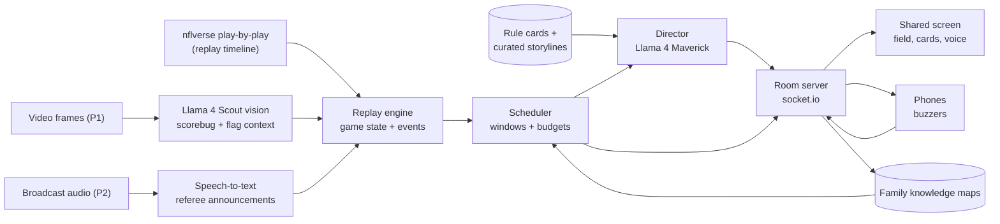
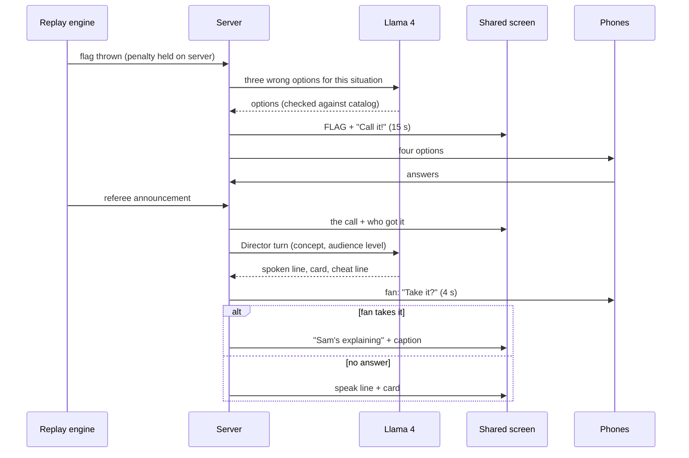

> **For Claude Code:** this is the Huddle product requirements document, a Markdown copy of the team's published PRD page. It is the source of truth for what Huddle does and why: users, design principles, feature IDs (F1–F15), priorities, and acceptance criteria. Implementation details live in `BUILD_PROMPT.md`. Do not edit this file; record deviations in `DECISIONS.md`.

*Product requirements · v1.1 · Meta challenge: Bringing People Closer Together with AI*

# Huddle

A game-night co-host that turns the non-fans in your family into fellow fans, then gets out of the way.

- Date: September 26, 2026
- Status: Draft for build
- Build window: 24–48 hours (assumed)
- Team: 2–4 people (assumed)
- Demo game: Super Bowl LVII · KC 38, PHI 35

## 1. Summary

Huddle is a shared-screen co-host for watching NFL games with family members who don't follow football. The TV (or a laptop beside it) shows the game state, a family scoreboard, and short explanations, and speaks them aloud during the natural pauses between plays. Everyone's phone works as a buzzer.

Rules come after caring. Huddle builds the caring first.

### The core loop

- **Stakes first.** Before big decisions (4th down, a 2-point try, a field goal), everyone predicts what happens. A running family scoreboard keeps score.
- **Learn by guessing.** When a flag drops, everyone guesses the penalty before the referee announces it. The explanation lands right when curiosity peaks.
- **People teach people.** Huddle offers each explanation to the fan first, with a one-line cheat on their phone. Later it offers them to family members who have learned that rule.
- **Fade out.** Huddle tracks what each person knows and stops explaining it. Success is Huddle saying almost nothing while the family argues about a call.

### Why AI is essential

AI reads the game (play data now, video frames and referee audio next), decides whether anything is worth saying to these particular people, writes a grounded explanation at the right depth, invents plausible wrong answers for each penalty guess, matches storylines to personalities, and tracks what each person has learned. Without it there is no timing, no personalization, and no fade.

### What we'll build

A web app (Node, React, socket.io) that replays real NFL games from open play-by-play data, with Meta's Llama 4 Maverick and Scout models doing the AI work through an OpenAI-compatible API. The demo game is Super Bowl LVII. Live broadcast mode, which reads the screen and the referee's audio, is the stretch goal.

**The demo moment**

Tied 35–35, 1:54 left, 3rd and 8. A flag drops. Mom guesses *defensive holding* before the referee says it, and gets it right. Three games later, Huddle stays quiet on the same kind of call and asks Mom to explain it to her daughter.

## 2. Problem and insight

When a fan watches football at home, the rest of the family often drifts to their phones. They would join in if they understood what was happening. Explaining rules mid-play doesn't work: the fan misses the game, the family gets a lecture, and nobody has fun.

### Three insights shape the product

1. **Rules come after caring.** People get hooked by stakes and by people, then learn rules to follow what they already care about. So Huddle leads with predictions and storylines, and explains a rule right after the play that made it interesting.

2. **A second screen splits the room.** An explainer app on every phone gives each person a private feed, and the room goes quiet. Huddle uses one shared screen and one voice. Phones only take taps.

3. **The fan is the best teacher, with help.** The fan knows the game but can't pause it, doesn't know what's confusing, and struggles to be brief. Huddle times the explanation, hands the fan a one-line cheat, and lets them take it.

### What exists today

| Option | What it does | Gap for a mixed room |
| --- | --- | --- |
| Broadcast AI features | Prime Video's *Thursday Night Football* added AI "Prime Insights" such as Defensive Alerts, which flags likely blitzers before the snap, and Coverage ID. This season it also added FanDuel bet tracking. | Deepens the game for people who already follow it. |
| League and stats apps | Scores, stats, highlights, alerts. | Built for fans; pulls attention to individual phones. |
| General AI chatbots | Answer "why was that a penalty?" if you know to ask. | You need to know what to ask, you stare at your phone, and it doesn't know your family. |

Nothing is built for the mixed room of one fan and several non-fans, and nothing is designed to make itself unnecessary.

## 3. Who it's for

**Primary:** households that watch together where one person loves football and one to four others don't follow it.

#### The Fan

*Installs Huddle · runs the TV*

Wants company, not students. Needs to keep watching, get credit for knowing things, and stop being the family's rulebook.

#### The Curious Skeptic

*Often a parent*

Open to it if it doesn't feel like homework. Needs to know what just happened in one sentence, and someone to root for.

#### The Scroller

*Often a sibling*

On their phone by the second quarter. Needs stakes, competition, drama, and a reason to look up.

#### The Numbers Person

*Likes odds and decisions*

Enjoys the coach's 4th-down math and a leaderboard. Needs the "why" behind decisions, briefly.

**Secondary:** a new partner at their first family game day; international students and new arrivals to the US; kids watching with a parent; relatives watching from another home (roadmap).

## 4. Goals and metrics

### Goals

- **G1.** Non-fans take part in the game with the fan (predicting, reacting, talking) instead of sitting beside them.
- **G2.** Non-fans learn enough in three or four games to follow a broadcast without help.
- **G3.** The fan gets to watch, and gets to teach on their own terms.
- **G4.** Huddle's role visibly shrinks over time.

### Non-goals

- Betting, odds, or fantasy features. Huddle is a family product.
- Replacing broadcast commentary, or deep strategy for experts.
- Accounts, social feeds, or monetization in the prototype.
- Sports other than the NFL during the hackathon.

### Success metrics

| Stage | Metric | Target |
| --- | --- | --- |
| Prototype | Condensed game runs start to finish with live Llama calls and no crash | 20–30 min |
| Prototype | Flags that produce a Call It round, with no penalty revealed early | 100% |
| Prototype | Spoken lines per quarter on Normal (excluding flags) | ≤ 6 |
| Prototype | Reduction in spoken lines, Game 4 preset vs. Game 1, same moments | ≥ 50% |
| Family test | Learners with at least one correct Call It | Every learner |
| Product | Share of prompts answered by learners | \> 70% |
| Product | Silence ratio: dead-time windows where Huddle stays quiet, rising game over game | Up each week |
| Product | Explanations given by learners (role reversals) per game | ≥ 2 by game 4 |
| Product | Families that start a second game within 14 days | \> 50% |

## 5. Design principles

- **Phones are buzzers.** Answers and private hints go to phones. Everything worth reading goes on the shared screen. No feeds, no scrolling.
- **Stakes before rules.** Predictions and storylines come first. A rule gets explained after the play that makes it interesting.
- **Talk only in dead time.** The play clock is 40 seconds. Huddle speaks between plays, one idea at a time, in about 10 seconds, and never during an open prediction window.
- **People before AI.** When someone in the room can explain it, Huddle offers them the chance first and hands them a cheat line.
- **Graduate people.** Each person's explanations get shorter as they learn, then stop. The goal is a Huddle that barely talks.

## 6. A game night, start to finish

1. **Setup (1 minute).** The fan opens Huddle on the laptop connected to the TV, picks the game and mode, and the TV shows a room code and QR code.

2. **Join and profile (2 minutes).** Everyone scans the code and answers three taps: what they usually watch, favorite or underdog, and a vibe (drama, numbers, or chaos). The fan marks "I know football."

3. **Storylines (30 seconds).** Each learner gets a player to follow, read aloud one at a time:

    - Mom (drama, family): "Watch the Kelce brothers. Travis plays for Kansas City, Jason for Philadelphia. They're the first brothers ever to face each other in a Super Bowl, so their mom has a son on each team."
    - Sister (underdog, chaos): "Watch Kadarius Toney. The Giants gave up on him and traded him midseason. Tonight is his second chance."
    - Dad (numbers): "Watch the kickers and the 4th-down calls. Every coach decision is a math problem."

4. **The live loop.** Most plays pass with nothing but a field update. Huddle acts at a few kinds of moments:

| Moment | On the shared screen | On phones |
| --- | --- | --- |
| Every play | Field, line of scrimmage, yellow first-down line, scorebug, plain-English ticker | Nothing |
| Decision point | "4th & 2 at the KC 34. What will Philly do?" with a countdown | Predict buttons, 12 s |
| Flag thrown | Yellow FLAG on the scorebug, "Call it!" | Four penalty options, 15 s |
| Referee announcement | The call, who got it right, points | Result and points |
| Dead time after a confusing play | One spoken line plus a caption card | Fan: "Take it?" for 4 s. Learners: Got it / Still confused |
| A storyline player makes a play | "Mom's guy just…" | Buzz on that person's phone |
| A rule someone has learned | Nothing, or "Mom, you called this last time. Want to explain it?" | Handoff prompt with a cheat line |

5. **Post-game (1 minute).** Each person gets a recap card: points, rules learned tonight, best call, and the moment of the night. A Copy button produces text for the family group chat.

6. **Across the season.** Knowledge persists per family. Explanations shrink game over game, and each recap shows the "rules you know" count growing.

## 7. Feature requirements

Priorities: **P0** must work in the demo · **P1** build after every P0 passes · **P2** roadmap and write-up only.

### F1 · Rooms and joining (P0)

- The host creates a room from the laptop. The TV shows a 4-letter room code and a QR code.
- Phones join over the local network in a browser, with a name and a color. No install.
- Each person picks a role: fan or learner. The host can change it.
- A phone that refreshes rejoins as the same player.

Acceptance:

- Five phones join in under 60 seconds.
- A refresh keeps points and role.

### F2 · Pre-game profiles and storylines (P0)

- Three tap-only questions per learner.
- AI assigns each learner a storyline from the team's curated file for that game and writes a personal card. Learners get different storylines when there are enough.
- Cards use only facts from the curated file, and only facts that don't spoil the game.

Acceptance:

- Assignment finishes in under 5 seconds.
- No card contains a fact outside the file or a result from later in the game.
- The host can reroll one card.

### F3 · Replay engine and field view (P0)

- Replays a real game from nflverse play-by-play with realistic pacing.
- Modes: **Full game**; **Condensed** (only plays with a decision, flag, score, turnover, review, storyline player, or big gain, with a one-line summary of skipped plays); **Demo moments** (a jump list).
- Field view: line of scrimmage in blue, first-down line in yellow, animated ball, possession arrow. Scorebug: score, quarter, clock, down and distance, timeouts, FLAG indicator.
- Host controls: play, pause, next play, jump to moment, speed.

Acceptance:

- Condensed Super Bowl LVII runs in 20–30 minutes.
- No play's result appears before its snap.
- The FLAG state shows before the penalty is named.

### F4 · Predict (P0)

- Triggers: 4th down (go for it, punt, or field goal; field goal hidden beyond the opponent's 45), 2-point try (in or not), and field-goal attempts on other downs (good or no good). Drive outcome in the last four minutes of a half and replay challenges (stands or overturned) are P1.
- A 12-second window. The engine waits for it. The TV shows who has locked in, not what they picked.
- Results come from the play data. A play wiped out by a penalty voids the prediction.
- After the result, Huddle explains the decision at the room's level.

Acceptance:

- Every qualifying play in the demo game triggers.
- Resolution matches play data in unit tests.

### F5 · Call It (P0)

- On every flagged play: the yellow FLAG, four options (the real penalty and three plausible wrong ones for that situation), and a 15-second window. Then the referee's announcement and the reveal.
- AI picks the wrong options from the situation (and, in P1, the video frame), checked against the penalty catalog. A fixed table by play type is the fallback.
- Each penalty maps to a rule card, and the explanation follows the reveal.

Acceptance:

- The real penalty is always among four distinct options.
- No penalty name appears on the TV, phones, voice, or ticker before the announcement. An automated test checks every message.

### F6 · The Director: explanations in dead time (P0)

- After each play, code finds candidate rule concepts tagged from the play data, keeps the ones some learner hasn't mastered, and checks the talk budget. The Director model picks one or stays silent, then writes a spoken line and a caption card grounded in the rule card and play data.
- Depth follows the least experienced learner present: full, short reminder, or silent.
- Talkativeness: Quiet (flags and decisions only), Normal (up to 6 per quarter, plus flags and decision results), Chatty (up to one every two plays).
- Voice uses the browser's speech synthesis on the TV. Every spoken line also appears as a caption.

Acceptance:

- Budgets hold in a full-game simulation.
- A slow or failed model call falls back to a template line within 4 seconds.
- Mute takes effect immediately.

### F7 · "I got this" and role reversal (P0)

- Before Huddle explains, the fan's phone offers "Take it?" for 4 seconds. If they tap it, Huddle stays quiet, the TV shows "Sam's explaining" with the caption card, and the fan's phone shows a one-line cheat.
- When a learner is Familiar with a concept that another learner present isn't, Huddle offers the explanation to them first.
- After a person explains, the others tap Got it or Still confused. Still confused triggers Huddle's short version.

Acceptance:

- Both flows work in the demo.
- A declined or expired offer falls back to Huddle within 1 second.

### F8 · Knowledge tracking and fade (P0)

- For each person and concept: New, Seen, Familiar, Mastered (thresholds in section 8).
- Saved per family across games.
- Demo presets "Game 1" and "Game 4" seed knowledge so the fade can be shown on camera. The TV labels the Game 4 preset as simulated.

Acceptance:

- With the Game 4 preset, the same moments produce at least 50% fewer spoken lines.

### F9 · Family scoreboard (P0)

- Predict correct: +100, plus 50 if fewer than half the room picked it. Call It correct: +150, plus 25 for the first correct lock-in. Explaining a rule to the room: +100 for learners; the fan's explanations count as assists.
- Fan handicap, on by default: the fan's correct answers score half.

Acceptance:

- The scoreboard updates within half a second of a reveal.

### F10 · Post-game recap (P0)

- One card per person plus a family card. Code computes the stats; AI writes the words. A Copy button produces group-chat text.

Acceptance:

- Ready within 8 seconds of the final whistle.
- Lists each person's concepts that reached Familiar or Mastered tonight.

### F11 · Plain-English ticker (P1)

Rewrites the official play text, such as "(1:54) (Shotgun) P.Mahomes pass incomplete short right to J.Smith-Schuster…", into a sentence a newcomer can follow. Penalty text is removed until the announcement.

### F12 · Video mode and sync tool (P1)

Plays a local video of the game inside Huddle with the rail beside it. A sync tool records the video time of each snap: play the video and press Space at every snap.

### F13 · Vision: scorebug reader and flag context (P1)

In video mode, frames go to Llama 4 Scout, which reads the scorebug (down, distance, clock, score, FLAG) and describes the flag moment to rank Call It options. A "Huddle sees" panel shows what it extracted. A small lab page accepts any broadcast screenshot. This is the multimodal path that live mode builds on.

### F14 · Live broadcast mode (P2)

Screen-capture a live broadcast: frames feed the scorebug reader for game state, and tab audio feeds speech-to-text to catch the referee's announcements. Streams protected by DRM often capture as black frames, so this needs testing with an over-the-air source or capture card.

### F15 · Remote family and group-chat recaps (P2)

Relatives in other homes join the same room from a hosted URL. Recaps post to the family's Messenger or WhatsApp group. NBA and college football follow.

## 8. AI system design

Code decides *when* Huddle may act. The model decides *what* is worth saying, and how to say it for these people. Every model output is JSON, checked against a schema, and replaced by a template if it's late or malformed.

### AI jobs

| Job | When | Model | Input | Output | Time limit | Fallback |
| --- | --- | --- | --- | --- | --- | --- |
| Storyline matching | Pre-game | Maverick | Profiles, curated storylines | A card per learner | 5 s | Tag-based assignment, template copy |
| Call It options | Flag | Scout (+ frame, P1) | Situation, penalty catalog, the real answer to avoid | 3 wrong options | 2.5 s | Table by play type |
| Director turn | Dead time | Maverick | Event, top 3 candidate concepts with rule cards, audience level, handoff candidates, recent lines | Silent, explain, or handoff; spoken line, card, cheat | 4 s | Template from the rule card |
| Storyline beat | A storyline player makes a play | Scout | Play, unlocked facts | One line | 3 s | Template |
| Ticker (P1) | Every play | Scout | Play text, penalty removed until announced | One sentence | 3 s | Cleaned play text |
| Scorebug reader (P1) | Video mode, every 2 s and at flags | Scout vision | Frame | Game state JSON | 2 s | Play data |
| Recap | Final whistle | Maverick | Game log, computed stats | Recap words | 8 s | Template |

### Scheduler rules (code, not the model)

- Windows: pre-snap (decisions only), flag, post-play dead time, quarter breaks, halftime.
- Never speak while a Predict or Call It window is open.
- At least 20 seconds between spoken lines on Normal, plus the per-quarter budget.
- Priority: penalties, then scoring rules, then clock and strategy after big decisions, then basics.
- A concept is a candidate only if the play data tags it and at least one learner present hasn't mastered it.

### Knowledge levels

| Level | Reached when | What Huddle does |
| --- | --- | --- |
| New | No exposures | Full explanation: up to 28 spoken words plus a card |
| Seen | 1 exposure | Short reminder, up to 12 words |
| Familiar | 2 exposures, or 1 correct recall | Short reminder, or offers this person the explanation |
| Mastered | 3 exposures and 1 recall; or 2 recalls; or explained it to the room | Silent for this person |

An exposure is the concept being explained while the person is present. A recall is a correct Call It on that penalty, or explaining it to the room. The room's depth is set by the lowest level among learners present.

### Grounding and spoiler rules

- Each concept has a rule card the team reviews: a plain definition, the penalty yardage, and a rulebook reference. The model may rephrase and connect it to the play. It may not add rule facts.
- Rules that changed recently (kickoffs, overtime) are explained as they applied in the game's season, or not at all.
- Storyline facts carry a "reveal after" moment, so a card never gives away a result before it happens. Unverified facts are excluded by default.
- Before an announcement, the penalty is removed from every model input except the Call It call, whose output stays on the server until the window opens.
- Tone: warm, brief, never condescending. Teasing only about predictions.

## 9. Architecture

Play data drives the prototype. Vision and audio plug into the same engine events later.

### What happens when a flag drops

### Stack

- Node 20 and TypeScript. Express and socket.io, with all room state held on the server.
- React and Vite for three screens: host setup, the shared TV screen, and the phone controller.
- Llama 4 Maverick and Scout through an OpenAI-compatible API. Groq lists both with 128K context, image input (up to 5 images), JSON mode, and tool use; Together also hosts them. Model IDs live in config, since provider catalogs change.
- Browser speech synthesis for the voice. JSON files for storage. No accounts.
- A mock model mode, so the whole app runs and tests pass without an API key.

## 10. Data and the demo game

### Sources

- **Play-by-play:** nflverse publishes open per-season files (for example `play_by_play_2022.csv.gz`) with down, distance, field position, clock, the official play text, penalty type, team and yards, scoring, timeouts, challenges, and win probability.
- **Rules:** the NFL Rulebook is the reference for rule cards. The team reviews every card before the demo.
- **Storylines:** curated per game by the team from reputable coverage, each fact marked with when it may be revealed.

### Why Super Bowl LVII

February 12, 2023: Kansas City 38, Philadelphia 35. Philadelphia led 24–14 at halftime. The fourth quarter alone has every moment the demo needs, and the brothers storyline suits a family product.

| Moment | What happened | Huddle feature |
| --- | --- | --- |
| The Kelce brothers | Travis (Chiefs) and Jason (Eagles) were the first brothers to play against each other in a Super Bowl. Their mother, Donna, had a son on each team. | Pre-game storyline |
| Toney's punt return | Kadarius Toney, traded away by the Giants midseason, returned a punt 65 yards, the longest in Super Bowl history. It set up a Chiefs touchdown. | Storyline beat |
| The tying 2-point try | Jalen Hurts ran in a 2-point conversion to tie it 35–35. | Predict |
| The holding call | 3rd and 8 at the Philadelphia 15, 1:54 left, tied. James Bradberry was flagged for defensive holding, giving Kansas City a first down and the chance to run down the clock. | Call It, then "I got this" on clock strategy |
| Bradberry's quote | "It was a holding. I tugged his jersey. I was hoping they would let it slide." | Color after the reveal |
| The winning kick | Harrison Butker's 27-yard field goal left 8 seconds on the clock. | Predict |
| Halftime | Rihanna's halftime show. | Halftime card |

**Footage**

The prototype draws its own field from the data, so it needs no broadcast video. Keep broadcast footage out of the public demo video; film faces and the Huddle screen. If the team wants a clip, check the hackathon's rules first.

## 11. Demo video plan

| Time | Scene | What the viewer sees |
| --- | --- | --- |
| 0:00 | Cold open | The real couch. You're yelling at the TV; everyone else is on their phones. Voiceover: "My family loves me. They don't love football." |
| 0:15 | Setup | The TV shows a room code; everyone scans and taps three answers. Mom gets the Kelce brothers: a mom with a son on each team. |
| 0:35 | Storyline beat | Toney's 65-yard return. Your sister's phone buzzes: her guy just set a Super Bowl record. She cheers. |
| 0:55 | Predict | The tying 2-point try. Everyone votes. Hurts scores. Huddle explains why a team goes for two instead of kicking. |
| 1:20 | Call It | Flag at 3rd and 8 with 1:54 left. Everyone guesses. The announcement: defensive holding. Mom got it. Huddle adds Bradberry's quote. |
| 1:50 | "I got this" | Your phone offers the clock explanation. You explain why a first down lets Kansas City run the clock down, glancing at the cheat line. |
| 2:10 | Fade | "Game 4" (labeled simulated). A similar flag: Huddle stays quiet and asks Mom to explain it. She explains holding to your sister. |
| 2:30 | Close | The recap lands in the family group chat. Final line: "Football used to be my thing. Now it's ours." |

### What's real and what's prepared

- **Real at runtime:** every model call (storylines, options, Director, beats, recap), the game engine, phones, scoring, knowledge tracking, and the voice.
- **Prepared:** the game is a replay of real play-by-play; storyline facts and rule cards are curated and reviewed; the Game 4 preset seeds knowledge, and the screen says so.
- Say this plainly in the write-up. Judges trust teams that label their shortcuts.

### Filming notes

- Use it with your family for two or three sessions before recording. A real moment beats a staged one.
- Record the Huddle screen with a screen recorder and the couch with a separate camera, then cut between them.
- Use a clip-on mic for the room; the TV voice should be audible but not dominant.
- Have Mom join first: the Game 4 preset seeds knowledge by join order, and slot 1 is the one who knows holding.
- Keep one full backup recording of the demo run in case the live take fails.

## 12. Submission write-up (draft)

The challenge asks who it's for, how it strengthens connection, and why AI is essential. Edit this to your own voice.

#### Huddle: football night for the whole family

**Who it's for.** Households where one person loves football and everyone else drifts to their phones. The non-fans would join in if they understood what was happening, but a fan explaining rules mid-play misses the game and turns it into a lecture.

**How it strengthens connection.** Huddle turns the TV into a shared game for the room. Before big decisions, everyone predicts what the coach will do. When a flag drops, everyone guesses the penalty before the referee announces it. Each family member gets a player to root for, matched to what they like. Explanations happen out loud, between plays, for everyone at once. Huddle offers each explanation to the fan first and hands them a cheat line, and later offers it to family members who've learned that rule. As people learn, Huddle goes quiet. Success is a family arguing about a call without it.

**Why AI is essential.** Huddle's AI reads the game state, decides whether anything is worth saying to these particular people, writes a short explanation grounded in reviewed rule cards, invents plausible wrong answers for each penalty guess, matches storylines to personalities, and tracks what each person knows so it can fade. It runs on Meta's Llama 4 Maverick and Scout; Scout's vision reads the broadcast scorebug.

**What's in the demo.** A replay of Super Bowl LVII from open nflverse play-by-play data, with every model call live. The "Game 4" segment uses seeded knowledge to show the fade, and is labeled as simulated.

## 13. Judge Q&A prep

#### "Couldn't I just ask Meta AI why that was a penalty?"

You'd have to know what to ask, you'd be looking at your phone instead of the game, and a chatbot doesn't know your family, doesn't time itself to the pauses, doesn't turn the game into a competition, and doesn't step aside for your brother.

#### "Isn't this an education app?"

Learning is a side effect. The product is the shared game: predictions, a family scoreboard, and people explaining things to each other. The metric we watch is learner participation, not quiz scores.

#### "If it fades away, how is AI essential?"

The AI is what makes the fade possible: it decides what each person is ready to stop hearing, and keeps timing, choosing, and grounding every moment it does speak. Most AI products measure success by how much you use them. Huddle measures it by how much your family talks to each other.

#### "Where's the multimodal part?"

Llama 4 Scout reads the broadcast scorebug and the flag moment from video frames (show the lab page), and live mode adds the referee's audio. The demo runs on play data so it can't fail on stage.

#### "What if it explains a rule wrong?"

It can only rephrase reviewed rule cards and the play data. It can't add rule facts, and templates replace any malformed output.

#### "Why would the fan want this?"

They get to watch the game, get company, and get to be the expert when they want to be, with a cheat line when they need one.

#### "How is it different from Prime Vision?"

Broadcast AI deepens the game for people who already follow it. Huddle is for the people on the couch who don't, and it's social by design.

#### "What about privacy?"

No accounts. Only first names, three tap answers, and public play data go to the model. Family progress stays in a local file.

## 14. Risks and mitigations

| Risk | Effect | Mitigation |
| --- | --- | --- |
| Huddle talks too much | It becomes the lecture it was meant to replace | Budgets, silence as the default, a talkativeness setting, one-key mute |
| A wrong rule explanation | Loses trust instantly | Reviewed rule cards, grounding, no free-form rule facts |
| A penalty revealed early | Ruins Call It | Server-side redaction and an automated test over every message |
| Model latency or outage during the demo | Dead air | 4-second limits, templates, a response cache, pre-warmed demo moments, a backup recording |
| Model IDs retired by the provider | Calls fail | IDs in config; check the provider's model list; mock mode still runs |
| Footage rights | Video taken down | Drawn field view; no broadcast footage in the public video |
| No natural moment in the family test | Weak demo | Run two or three sessions; label any simulated segment |
| Venue Wi-Fi blocks phones from the laptop | Nobody can join | Phones join the laptop's hotspot; everything except model calls runs locally |
| DRM blocks screen capture (live mode) | Black frames | Keep live mode as P2; test with an over-the-air source or capture card |

## 15. Build plan and team split

This assumes about 36 hours. For 24 hours, cut P1 to the ticker and the vision lab page only.

| Hours | Goal | Done when |
| --- | --- | --- |
| 0–2 | Kickoff; run the build prompt in Claude Code; review storylines and rule cards in parallel | Repo scaffolded; data pipeline has produced the Super Bowl LVII timeline |
| 2–10 | P0 end to end in mock mode, then with Llama | A condensed game runs on the TV with three phones |
| 10–16 | Family test 1; tune budgets, prompts, pacing | Notes from real use; fixes merged |
| 16–24 | P1: ticker, vision lab, video mode | "Huddle sees" works on a screenshot |
| 24–30 | Family test 2 and filming; backup recording | Raw footage of every scene in section 11 |
| 30–36 | Edit video, finish write-up and README, make the repo public, buffer | Submitted |

### Who does what

| Role | Owns |
| --- | --- |
| Engine | Data pipeline, replay engine, Predict and Call It resolution, tests |
| AI | Model layer, prompts, Director, fallbacks, vision |
| Screens | TV and phone UI, field view, voice, animations |
| Product and demo | Rule card and storyline review, family sessions, filming, write-up |

With three people, merge Engine and AI. With two, one person takes Engine and AI, the other Screens and Product.

## 16. Build prompt for Claude Code

A single prompt that tells Claude Code to build the whole P0 prototype, then the P1 features, with tests and a full-game simulation as checks. It runs without an API key in mock mode, so the build can be verified before anyone adds a key.

### How Claude Code keeps this PRD in view

- The repository includes this PRD as `docs/PRD.md` and a `CLAUDE.md` file at the root. Claude Code reads `CLAUDE.md` at the start of every session and re-reads it after the conversation is compacted. `CLAUDE.md` imports `docs/PRD.md`, so the full PRD is loaded every time.
- The build prompt makes the PRD the source of truth for product behavior and acceptance criteria. The build prompt itself decides implementation details.
- Claude Code names the PRD feature ID before starting each feature, keeps a traceability table (PRD ID, status, files, tests) in the README, and must meet every P0 acceptance criterion before moving on.
- Claude Code never edits the PRD. Any deviation goes in `DECISIONS.md` for the team to resolve.

### Setup

1. Create an empty repository and add three files: `BUILD_PROMPT.md` and `CLAUDE.md` at the root, and this PRD as `docs/PRD.md`.

2. Start Claude Code in the repository and run: `Read BUILD_PROMPT.md and build everything it describes, phase by phase.`

3. While it builds, the Product owner reviews `data/concepts.json` and `data/games/…/storylines.json`.

4. Add a Groq (or Together) key to `.env`, set `LLM_PROVIDER=openai_compatible`, and run `npm run dev`.

5. When this PRD changes, replace `docs/PRD.md` with the new version and tell Claude Code which sections changed.

The full prompt is BUILD_PROMPT.md at the repository root.

## 17. Open questions

- How long is the hackathon, and how many people are on the team? This plan assumes 24–48 hours and 2–4 people.
- Does the hackathon provide Meta model access or credits? If so, point the model config there.
- What are the rules on third-party footage in the demo video?
- Which family members are willing to be filmed, and when can the two sessions happen?
- Should there be a hosted demo URL for judges, or is the public repo plus video enough?

## 18. Sources

- [Prime Video: fifth season of Thursday Night Football, AI Prime Insights and bet tracking (Sept 15, 2026)](https://press.amazonmgmstudios.com/us/en/press-release/prime-video-kicks-off-fifth-season-of-exclusive-it)
- [Barrett Media: Prime Insights' five AI tools for 2026](https://barrettmedia.com/2026/09/15/prime-video-interactive-broadcast-enhancements-nfl/)
- [Groq changelog: Llama 4 Scout and Maverick support](https://console.groq.com/docs/changelog)
- [Together AI: Llama 4 Maverick API](https://www.together.ai/models/llama-4-maverick)
- [nflverse play-by-play data](https://github.com/nflverse/nflverse-pbp)
- [CBS News: Chiefs edge Eagles 38–35 in Super Bowl LVII](https://www.cbsnews.com/amp/live-updates/kansas-city-chiefs-defeat-philadelphia-eagles-super-bowl-lvii/)
- [NFL.com: Bradberry on the third-down penalty](https://www.nfl.com/news/eagles-cb-james-bradberry-on-crucial-third-down-penalty-it-was-holding)
- [FOX 10: Super Bowl LVII top moments (Toney's return, halftime)](https://www.fox10phoenix.com/news/super-bowl-lvii-top-moments-that-happened-on-off-and-above-the-field)
- [Guinness World Records: first brothers to play against each other in a Super Bowl](https://www.guinnessworldrecords.com/world-records/767863-first-brothers-to-play-against-each-other-in-a-super-bowl)
- [NBC News: Donna Kelce, first mom with two sons playing against each other in a Super Bowl](https://www.nbcnews.com/news/us-news/donna-kelce-first-mom-two-sons-play-super-bowl-says-awesome-rcna68578)
- [Sports Illustrated: the five biggest plays (24–14 halftime lead)](https://www.si.com/nfl/eagles/news/philadelphia-eagles-kansas-city-chiefs-five-biggest-plays)
- [NFL Football Operations: the rulebook](https://operations.nfl.com/the-rules/nfl-rulebook/)
